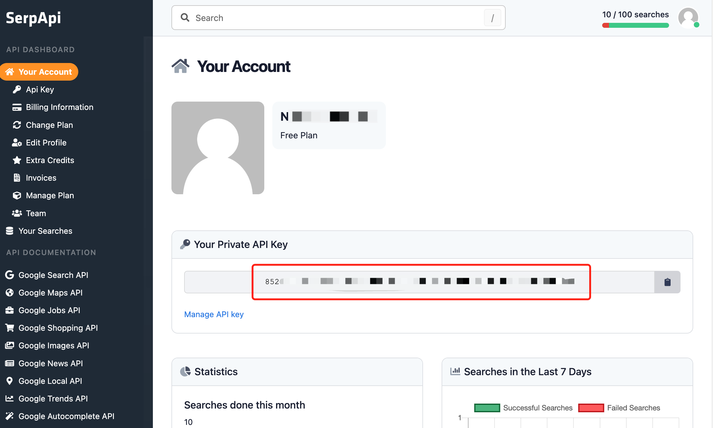

# GoogleSearch

Một công cụ để thực hiện tìm kiếm Google SERP và trích xuất các đoạn trích (snippets) và trang web. Đầu vào phải là một truy vấn tìm kiếm.

## Cách sử dụng

Cài đặt plugin, sau đó thiết lập `api_key` trong cấu hình plugin.
Bạn có thể lấy `api_key` từ [SERP API](https://serpapi.com/dashboard).

